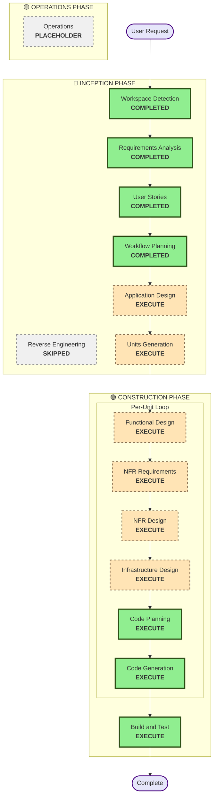

# Workflow Planning - Execution Plan

## Detailed Analysis Summary

### Project Context
- **Project Type**: Greenfield Flutter mobile application
- **Scope**: System-wide - Complete mobile application with 13+ features/modules
- **Complexity**: Complex - Multi-feature enterprise mobile application
- **Platforms**: Android (API 28+), iOS (15+), Web
- **Technology Stack**: Flutter 3.38.2, Material Design 3, BLoC/Cubit, Hive with encryption

### Transformation Scope
- **Transformation Type**: New Application Development (Greenfield)
- **Primary Changes**: Complete new mobile application development
- **Related Components**: None (new project)

### Change Impact Assessment
- **User-facing changes**: Yes - Entire new mobile application with 13+ user-facing features
- **Structural changes**: Yes - New application architecture with Clean Architecture + BLoC pattern
- **Data model changes**: Yes - New local data models, API integration models, state management models
- **API changes**: Yes - Integration with existing backend APIs (15+ functional requirements with multiple endpoints)
- **NFR impact**: Yes - Performance (60fps), Security (certificate pinning, encrypted storage), Scalability (offline support, caching), Push notifications (FCM/HMS)

### Component Relationships
N/A - Greenfield project, no existing components

### Risk Assessment
- **Risk Level**: Medium
- **Rollback Complexity**: Moderate (new project, can revert commits)
- **Testing Complexity**: Complex (comprehensive testing: unit, widget, integration, e2e)
- **Key Risk Factors**:
  - Multiple platform support (Android, iOS, Web)
  - Complex integrations (Microsoft OAuth, FCM/HMS, Google Fit/Apple Health)
  - Multiple features requiring coordination
  - High performance requirements

---

## Workflow Visualization

### Mermaid Diagram

### Text Alternative

**Phase 1: INCEPTION**
- Stage 1: Workspace Detection (COMPLETED)
- Stage 2: Reverse Engineering (SKIPPED - Greenfield project)
- Stage 3: Requirements Analysis (COMPLETED)
- Stage 4: User Stories (COMPLETED)
- Stage 5: Workflow Planning (COMPLETED)
- Stage 6: Application Design (EXECUTE - New components and services needed)
- Stage 7: Units Generation (EXECUTE - Complex system needs decomposition)

**Phase 2: CONSTRUCTION (Per-Unit Loop)**
- For each unit:
  - Functional Design (EXECUTE - New data models and business logic)
  - NFR Requirements (EXECUTE - Performance, security, scalability needs)
  - NFR Design (EXECUTE - NFR patterns need incorporation)
  - Infrastructure Design (EXECUTE - Mobile app deployment architecture)
  - Code Planning (EXECUTE - ALWAYS)
  - Code Generation (EXECUTE - ALWAYS)
- Build and Test (EXECUTE - ALWAYS)

**Phase 3: OPERATIONS**
- Operations (PLACEHOLDER - Future expansion)

---

## Phases to Execute

### 🔵 INCEPTION PHASE
- [x] Workspace Detection (COMPLETED)
- [x] Reverse Engineering (SKIPPED - Greenfield project, no existing code)
- [x] Requirements Analysis (COMPLETED)
- [x] User Stories (COMPLETED)
- [x] Workflow Planning (COMPLETED)
- [ ] Application Design - **EXECUTE**
  - **Rationale**: New components and services needed. Component methods and business rules need definition. Service layer design required for API integration, state management, and feature orchestration. Component dependencies need clarification for Clean Architecture implementation.
- [ ] Units Generation - **EXECUTE**
  - **Rationale**: Complex system with 13+ features requiring decomposition into manageable units of work. Multiple services/modules required (Authentication, Profile, QR Wallet, Announcements, Eclaims, AstroDesk, etc.). System requires structured breakdown for parallel development.

### 🟢 CONSTRUCTION PHASE

#### Per-Unit Loop (for each unit)
- [ ] Functional Design - **EXECUTE**
  - **Rationale**: New data models needed (user models, API response models, state models). Complex business logic (authentication flows, payment processing, claims management, health data sync). Business rules need detailed design (validation rules, state transitions, error handling).
- [ ] NFR Requirements - **EXECUTE**
  - **Rationale**: Performance requirements exist (60fps animations, instant navigation). Security considerations needed (certificate pinning, encrypted storage, OAuth). Scalability concerns present (offline support, caching strategy). Tech stack selection required (already selected but needs validation).
- [ ] NFR Design - **EXECUTE**
  - **Rationale**: NFR Requirements will be executed, so NFR patterns need to be incorporated (caching patterns, security patterns, performance optimization patterns, offline-first patterns).
- [ ] Infrastructure Design - **EXECUTE**
  - **Rationale**: Mobile app deployment architecture required (build flavors for dev/staging/prod, app store deployment, OTA updates). Infrastructure services need mapping (push notification setup, analytics integration, crash reporting setup).
- [ ] Code Planning - **EXECUTE** (ALWAYS)
  - **Rationale**: Implementation approach needed for each unit
- [ ] Code Generation - **EXECUTE** (ALWAYS)
  - **Rationale**: Code implementation needed for each unit

#### After All Units Complete
- [ ] Build and Test - **EXECUTE** (ALWAYS)
  - **Rationale**: Build, test, and verification needed for complete application

### 🟡 OPERATIONS PHASE
- [ ] Operations - **PLACEHOLDER**
  - **Rationale**: Future deployment and monitoring workflows

---

## Package Change Sequence

N/A - Greenfield project, no existing packages to update

## Unit Decomposition Strategy

Based on the complexity and feature set, the system will be decomposed into logical units of work. Potential unit breakdown:
- **Unit 1**: Core Infrastructure (Authentication, Home, Navigation, State Management)
- **Unit 2**: User Management (Profile, Settings)
- **Unit 3**: Content & Communication (Announcements, AstroNet, Content Highlights)
- **Unit 4**: Financial Services (QR Wallet, Payment Processing)
- **Unit 5**: Business Services (Eclaims, AstroDesk, Report Piracy)
- **Unit 6**: Wellness & Engagement (Steps Challenge, Friends & Family, Sooka Share)

*Note: Final unit breakdown will be determined in Units Generation stage based on dependencies and development priorities.*

---

## Estimated Timeline

- **Total Phases**: 9 stages (2 INCEPTION + 7 CONSTRUCTION)
- **Estimated Duration**: Complex project requiring comprehensive design and implementation
- **Development Approach**: Per-unit sequential development (complete each unit fully before next)

---

## Success Criteria

- **Primary Goal**: Build complete Flutter mobile application for Easy App with all 13+ features
- **Key Deliverables**:
  - Application design with component architecture
  - Unit decomposition with clear boundaries
  - Functional designs for all units
  - NFR designs implementing performance, security, and scalability requirements
  - Infrastructure design for mobile deployment
  - Complete codebase with all features implemented
  - Comprehensive test suite (unit, widget, integration, e2e)
  - Build and test instructions
- **Quality Gates**:
  - All user stories implemented with acceptance criteria met
  - Code follows Clean Architecture + BLoC pattern
  - Comprehensive test coverage (target 70%+)
  - Performance targets met (60fps, instant navigation)
  - Security requirements implemented (certificate pinning, encrypted storage)
  - Offline support working (cached viewing, online actions)
  - Push notifications working (FCM and HMS)
  - Health data integration working (Google Fit and Apple Health)
  - All platforms supported (Android, iOS, Web)

---

## Phase Execution Rationale Summary

### INCEPTION PHASE
- **Application Design**: Required to define component architecture, service layer, and component dependencies for Clean Architecture implementation
- **Units Generation**: Required to decompose 13+ features into manageable development units for parallel development

### CONSTRUCTION PHASE
- **Functional Design**: Required for new data models, complex business logic, and business rules across all features
- **NFR Requirements**: Required for performance (60fps), security (certificate pinning), scalability (offline support), and integration requirements
- **NFR Design**: Required to incorporate NFR patterns based on NFR Requirements assessment
- **Infrastructure Design**: Required for mobile app deployment architecture, build flavors, and infrastructure service setup
- **Code Planning & Generation**: Always required for implementation
- **Build and Test**: Always required for verification

---

## Next Steps

1. User reviews and approves this execution plan
2. Proceed to Application Design stage
3. Then proceed to Units Generation stage
4. Then proceed to CONSTRUCTION PHASE per-unit loop

